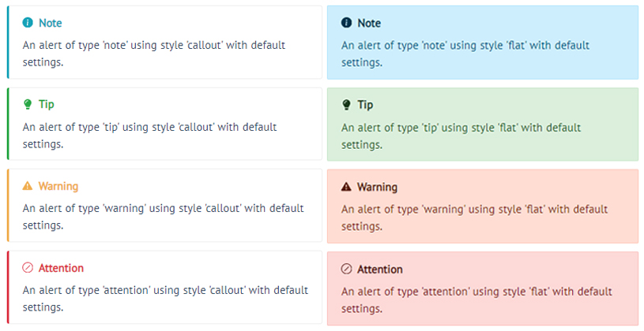

> 想帮助改进本文档？请阅读以下内容

## 准备工作

本文档是基于 `Docsify` 构建的，一款小巧轻量基于 `Markdown` 的文档生成框架 <br>

如果你想要在你的电脑上启动本地测试，你需要拉取 `本文档代码仓`，以及安装 `Docsify`

```shell
# git clone https://openi.pcl.ac.cn/chenzh/opendoc.git
# npm i docsify-cli -g
```

>[!warning|label:安装须知|icon:fa-solid fa-download]
> - 安装 `Docsify` 需要使用到 `Node.js` 中的 `npm` 指令
> - `npm` 是随同 `Node.js` 一起安装的包管理工具，你可以使用 `npm -v` 来查看其是否安装在你的电脑上
> - 若你的电脑未安装 `Node.js`，请移步至 [Node.js官方下载地址](https://nodejs.org/zh-cn/download/) 下载安装

来到代码仓目录，输入下列指令启动本地服务  *下列 /.../ 为你的本地电脑存放目录* <br>

在浏览器打开 http://localhost:3000 即可看到本地启动的文档

```shell
# cd opendoc
# docsify serve ./docs

Serving /.../opendoc/docs now. 
Listening at http://localhost:3000
```

## 文档结构

```text
.
├── README.md
└── docs/
    ├── .nojekyll
    ├── _sidebar.md
    ├── index.html
    ├── README.md
    ├── _media/
    │   ├── repo/
    │   │   ├── pic.png
    │   │   └── ...
    │   └── ...
    ├── repo/
    │   ├── create.md
    │   └── ...
    └── ...
```
- 文档工程目录为 `./docs`
- 在根目录下的 `README.md` 为文档代码仓描述文件，`./docs` 下的 `README.md` 文件为文档首页
- `index.html` 为文档的网页配置界面，你可以在这里更改 `文档页面设置`，配置 `文档渲染插件`，修改网页 `css` 样式等
- `_sidebar.md` 内可编辑文档侧边栏显示内容
- `_media/` 文件夹下存放文档内使用的图片素材
- 其余文件，如上示例中 `repo/` 为文档各层级目录，里面存放的每个 `Markdown` 文件为单独文档页面

>[!tip|label:内容修改|icon:fa-solid fa-pen fa-bounce]
> - 若只涉及到文档的文本内容修改，你可以在 `_sidebar.md` 中找到想要修改章节的 `.md` 文件路径
> - 根据文件路径，打开 `.md` 文件，使用 `Markdown` 语法修改内容后保存提交代码即可

## 修改侧边栏

- 在 `_sidebar.md` 中编辑侧边栏菜单，格式为 `Markdown` 语法列表结构
- 加入新文档页使用 `Markdown` 的超链接语法，在中括号中写入侧边栏显示名称，在小括号内写入 `.md` 文件路径即可

```markdown
<!-- docs/_sidebar.md -->

- 快速开始
    - [PyTorch手写识别GPU训练](quickstart/quickstartGPU.md)
    - [文档速览](quickstart/quickmenu.md)
```

## 修改文档-文本编写

- 使用 `Markdown` 语法修改即可，建议遵循如下规则
    - 避免编写大段文字内容，尽量使用简短的文字说明，可以使用列表结构增加可读性
    - 文档内二级标题在点击文档名称时会在侧边栏展开，点击可快速跳转到相应部分
    - 使用代码高亮功能Highlight关键字

## 修改文档-插入图片

- 本文档使用嵌入html语法插入图片
    - 请将图片放入 `_media/` 文件夹下，在 `src` 中填入图片路径，建议其他参数保持不变
    - 浏览器内截图建议使用 `chrome` 中的 `Standardized Screenshot` 插件，可以为图片边缘增加阴影效果
    - 复制下列代码到 `.md` 文档中，修改 `src` 中图片路径即可插入

```markdown

```

## 修改文档-引用

- `Docsify` 提供了三种引用方法，如下所示

```markdown
> 这是 Markdown 默认引用
!> 这是 Docsify 警示引用
?> 这是 Docsify 高亮引用
```

> 这是Markdown默认引用

!> 这是 Docsify 警示引用

?> 这是 Docsify 高亮引用

## 修改文档-提示框

- 本文档中使用了提示框插件，可插入定制化高亮提示框



- 提示框提供两种样式和四种颜色，可定制名称和图标

<br>

```markdown
> [!tip]
> 这是绿色提示框，内部也支持 `Markdown` 语法
```

> [!tip]
> 这是绿色提示框，内部也支持 `Markdown` 语法

```markdown
> [!attention|label:自定义名称|icon:fa-solid fa-wand-magic-sparkles]
> 这是自定义名称，图标的红色提示框
```

> [!attention|label:自定义名称|icon:fa-solid fa-wand-magic-sparkles]
> 这是自定义名称，图标的红色提示框

<br>

- 参数说明，使用英文符号 `|` 分隔参数，前后不能有空格
- 除!关键词外，其余参数顺序不定 

| 参数名称 | 取值说明 |
| --------------- | ---- |
| !关键词 | `!tip` `!note` `!warning` `!attention` ，开头为英文符号! |
| style |  `callout`(default) 或 `flat` |
| label  | `关键词`(default) 或 自定义中英文或空格，不能有符号 |
| icon  | 如上图 (default) 或 使用 [FontAwsome](https://fontawesome.com/search?o=r&m=free), e.g. `fas fa-comment` |
| labelVisibility | `visible` (default) 或 `hidden` |
| iconVisibility  | `visible` (default) 或 `hidden` |

- `FontAwsome` 额外支持动画效果，在名称后面加上动画名称即可
- 如 `fa-solid fa-heart` -> `fa-solid fa-heart fa-bounce`

| 效果 | 代码|
| :---: | :---: |
| :fa-solid fa-heart: | 原始 |
| :fa-solid fa-heart fa-beat: | fa-beat |
| :fa-solid fa-heart fa-fade: | fa-fade |
| :fa-solid fa-heart fa-bounce: | fa-bounce |
| :fa-solid fa-heart fa-spin: | fa-spin |
| :fa-solid fa-heart fa-shake:  | fa-shake |
| :fa-solid fa-heart fa-flip: | faflip |

## 修改文档-Tab框

- 文本中使用了 `Tab` 框进行内容分类，用法如下

```markdown
<!-- tabs:start -->

#### **zh**

中文

#### **en**

English

<!-- tabs:end -->
```

<!-- tabs:start -->

#### **zh**

中文

#### **en**

English

<!-- tabs:end -->